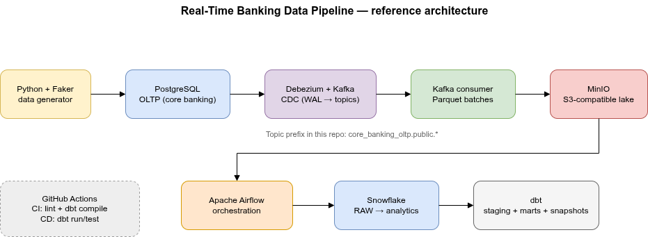
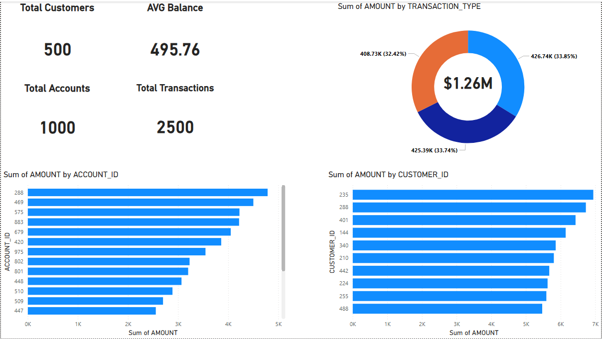
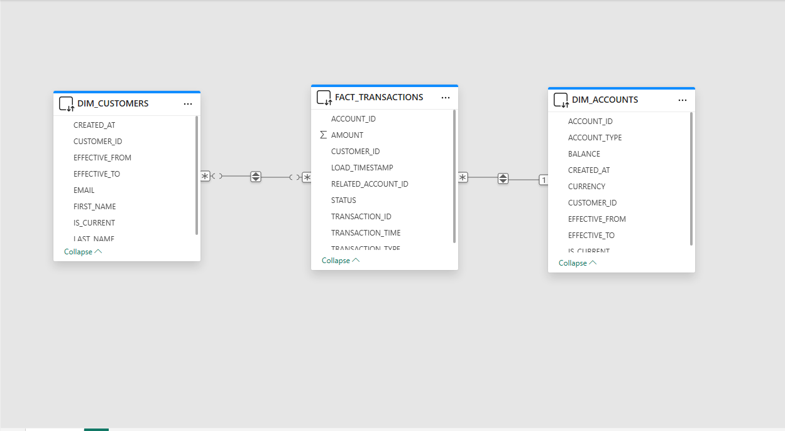

# Real-Time Banking Data Pipeline

A data engineering pipeline that captures changes from a banking database in real time using CDC, lands them as Parquet in object storage, loads them into Snowflake, and transforms them into analytics-ready models with dbt.



> Editable diagram: [`docs/architecture.drawio`](docs/architecture.drawio) — open with [diagrams.net](https://app.diagrams.net/).

## How it works

1. A Python script generates synthetic customers, accounts, and transactions into **PostgreSQL**.
2. **Debezium** reads the Postgres write-ahead log and publishes change events to **Kafka** topics.
3. A **Kafka consumer** batches those events and writes **Parquet** files into **MinIO** (S3-compatible storage).
4. **Airflow** picks up new files from MinIO and loads them into **Snowflake** raw tables (bronze layer).
5. **dbt** builds staging views, fact/dimension tables, and SCD Type 2 snapshots on top of that raw data.
6. **GitHub Actions** handles CI (lint, tests, dbt compile) and CD (dbt run on merge).
7. **Power BI** connects to the warehouse (gold-layer models) for dashboards and self-service analytics.

## Tech stack

| Layer | Tool |
|-------|------|
| Source database | PostgreSQL |
| Data generation | Python, Faker |
| Change data capture | Kafka, Debezium |
| Object storage | MinIO |
| Orchestration | Apache Airflow |
| Warehouse | Snowflake |
| Transformations | dbt |
| Visualization | Power BI |
| Containers | Docker Compose |
| CI/CD | GitHub Actions |

## Power BI dashboard

The report summarizes synthetic banking activity from the pipeline: headline KPIs (customers, average balance, accounts, transactions), transaction mix by type, and top accounts and customers by transaction amount.



## Power BI data model

The semantic model is a star schema centered on **`FACT_TRANSACTIONS`**, with **`DIM_CUSTOMERS`** and **`DIM_ACCOUNTS`**. Dimensions include SCD-style fields (`EFFECTIVE_FROM`, `EFFECTIVE_TO`, `IS_CURRENT`) so historical versions align with dbt snapshots. Relationships connect facts to dimensions for filtering and aggregation in the visuals above.



## Project structure

```
├── data-generator/        # Faker-based synthetic data loader
├── kafka-debezium/        # Debezium connector registration
├── consumer/              # Kafka → MinIO Parquet writer
├── docker/dags/           # Airflow DAGs (bronze load + dbt snapshots/marts)
├── banking_dbt/           # dbt project (staging, marts, snapshots)
├── postgres/              # OLTP schema DDL
├── tests/                 # Layout checks for CI
├── docs/                  # Architecture diagram (.drawio)
├── docker-compose.yml
├── dockerfile-airflow.dockerfile
└── .github/workflows/     # CI and CD pipelines
```

## Getting started

1. Copy `.env.example` to `.env` and fill in your credentials. Add `.env` files under `consumer/`, `data-generator/`, `kafka-debezium/`, and `docker/dags/` as needed.
2. Start the infrastructure: `docker compose up -d`
3. Apply the schema: run `postgres/schema.sql` against the Postgres instance.
4. Run the data generator, register the Debezium connector, start the Kafka consumer.
5. Trigger the Airflow DAGs and let dbt build the models.

## Based on

This project is based on [banking-modern-datastack](https://github.com/Jay61616/banking-modern-datastack) by Jaya Chandra Kadiveti. I rebuilt and extended it with my own changes: different CDC naming and topic prefix, Docker Compose health checks and startup ordering, restructured dbt project defaults, proper DAG task chaining, environment handling, tests, CI improvements, and documentation including the architecture diagram.
